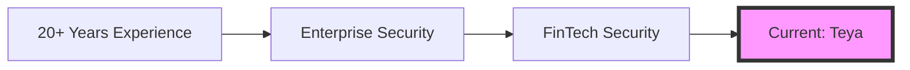

# Warwick Brown
[](https://teya.com)
[](https://www.isc2.org/Certifications/CISSP)
[](https://www.isc2.org/Certifications/CCSP)
[](https://www.isc2.org/Certifications/CSSLP)


> "Delivering secure, innovative financial technology solutions through meticulous engineering and strategic security design"

## 🚀 Current Role
Senior Security Engineer at Teya
- 🏢 Architecting secure financial services infrastructure for SMBs
- 🛡️ Managing PCI-DSS compliance implementation and maintenance
- 🔒 Developing robust security engineering solutions
- 📊 Leading security metrics and monitoring initiatives

## 👀 Professional Focus & Expertise
```yaml
Security Domains:
  - Financial Services Security
  - PCI-DSS Compliance
  - Cloud Security Architecture
  - Security Engineering
  - FinTech Infrastructure Protection

Tech Stack:
  Cloud Platforms:
    - AWS
    - GCP
    - Azure
  Security Tools:
    - HashiCorp Vault
    - CloudFlare
    - CrowdStrike
  Infrastructure:
    - Terraform
    - Docker
    - Kubernetes
  Monitoring:
    - ELK Stack
    - Splunk
    - Prometheus/Grafana
```

## 🌱 Current Learning Goals
1. Advancing Zero Trust Architecture implementation
2. Enhancing Cloud-Native security patterns
3. Exploring AI/ML in Security Operations

## 📚 Featured Projects & Contributions

### 🛡️ Security Automation Framework
- Developed comprehensive security automation using IaC
- Tech: Terraform, AWS, Python

### 🔍 Enhanced Detection Engineering
- Created custom threat detection rules
- Tech: Splunk, Set Logic, Semantics

### 🔐 PCI-DSS Compliance Toolkit
- Built automated compliance checking tools
- Streamlined audit preparations

## 💼 Professional Journey


## 🎓 Certifications & Training
- CISSP (ISC²) - Certified Information Systems Security Professional
- CCSP (ISC²) - Certified Cloud Security Professional
- CSSLP (ISC²) - Certified Secure Software Lifecycle Professional

## 🛠️ Technical Proficiency


## 📫 Connect With Me
- 📧 Email: warwick.brown@teya.com
- 📱 Mobile: [+44 (0)7540 298 709](tel:+447540298709)
- 🔗 LinkedIn: [Warwick Brown](https://www.linkedin.com/in/warwick-brown-1a66a58)
- 💻 GitHub: [@warwickbrownteya](https://github.com/warwickbrownteya)
- 📝 Blog: [Security Insights](https://medium.com/@warwickbrown)

## 📊 GitHub Activity


#infosec #cybersecurity #fintech #cloudsecurity #devsecops #securityengineering #pcidss

---
💡 *Open to collaboration on security projects and mentoring opportunities*
