# Warwick Brown
[](https://teya.com)
[](https://www.isc2.org/Certifications/CISSP)
[](https://www.isc2.org/Certifications/CCSP)
[](https://www.isc2.org/Certifications/CSSLP)

## 🏗️ Security Engineering Leadership

```mermaid
graph TB
    ORG["🏢 Payment Acquiring<br/>Merchant Bank"]

    ORG --> ROLE["I Lead<br/>Security Engineering"]

    ROLE --> DOMAIN1["🎯 Compliance &<br/>Regulatory"]
    ROLE --> DOMAIN2["🚨 Incident<br/>Response"]
    ROLE --> DOMAIN3["🏗️ Governance &<br/>Architecture"]
    ROLE --> DOMAIN4["🔧 Security<br/>Architecture"]

    style ORG fill:#374151,color:#ffffff,stroke:#000000,stroke-width:2px
    style ROLE fill:#dc2626,color:#ffffff,stroke:#000000,stroke-width:3px
    style DOMAIN1 fill:#0d47a1,color:#ffffff,stroke:#000000,stroke-width:2px
    style DOMAIN2 fill:#c41e3a,color:#ffffff,stroke:#000000,stroke-width:2px
    style DOMAIN3 fill:#6a1b9a,color:#ffffff,stroke:#000000,stroke-width:2px
    style DOMAIN4 fill:#00695c,color:#ffffff,stroke:#000000,stroke-width:2px
```



> "Leading security engineering for regulated payment infrastructure through formal governance frameworks, incident response, and strategic compliance architecture"

## 🚀 Current Role
Acting Head of Security Engineering at Teya
- 👥 Lead security engineering team (2 principal engineers, 1 senior engineer)
- 🏦 Manage security for regulated payment acquiring merchant bank
- 📋 Ensure compliance: PCI-DSS, PCI-PIN, PCI-MPOC, PCI-SDL, ISO 27001/27002, GDPR, NIS2
- 🛡️ Direct incident response and regulatory audit processes
- 🏗️ Architect formal governance frameworks and compliance infrastructure
- 🔄 Interface with CISO, security director, GRC leadership, and IT leadership

## 📊 Regulatory & Compliance Scope


## 👀 Professional Focus & Expertise
```yaml
Primary Domains:
  - Payment Services Security (PCI-DSS, PCI-PIN, PCI-MPOC, PCI-SDL)
  - Regulated Financial Institution Security
  - Governance & Compliance Frameworks
  - Incident Response & Management
  - Information Security Management (ISO 27001/27002)
  - EU Regulatory Compliance (GDPR, NIS2)
  - Team Leadership & Development

Technical Expertise:
  Governance & Architecture:
    - Formal governance frameworks
    - Semantic web & RDF/N3 ontologies
    - Distributed systems & microservices
    - Authority delegation & access control

  Cloud & Infrastructure:
    - AWS, GCP, Azure
    - Kubernetes & container orchestration
    - Terraform & infrastructure as code
    - HashiCorp Vault

  Security Operations:
    - Incident management systems
    - SIEM & monitoring (ELK, Splunk, Prometheus/Grafana)
    - Compliance automation
    - Threat detection & response

  Formal Methods:
    - SAT/SMT solvers
    - First-order logic & theorem proving (Coq, Lean)
    - Protocol analysis (Tamarin)
    - Post-quantum cryptography (NIST FIPS 204)
```

## 🌱 Current Focus
- Zero Trust Architecture implementation
- NIS2 & GDPR compliance operational excellence
- Formal methods applied to security governance
- AI/ML integration in security operations
- Team development & mentoring

## 🔐 My Security Operations Model

```mermaid
graph TB
    A["🚨<br/>Detection"]
    B["📊<br/>Classification"]
    C["⚡<br/>Response<br/>Orchestration"]
    D["📋<br/>Notification &<br/>Documentation"]
    E["✓<br/>Resolution"]
    F["📚<br/>Continuous<br/>Improvement"]

    A --> B
    B --> C
    C --> D
    D --> E
    E --> F

    G["🏗️ Governance<br/>Framework"]
    H["📈 Metrics &<br/>Monitoring"]

    G -.->|Guides| C
    H -.->|Feeds| A

    style A fill:#ffffff,color:#000000,stroke:#1f2937,stroke-width:2px
    style B fill:#ffffff,color:#000000,stroke:#1f2937,stroke-width:2px
    style C fill:#dc2626,color:#ffffff,stroke:#000000,stroke-width:3px
    style D fill:#ffffff,color:#000000,stroke:#1f2937,stroke-width:2px
    style E fill:#ffffff,color:#000000,stroke:#1f2937,stroke-width:2px
    style F fill:#ffffff,color:#000000,stroke:#1f2937,stroke-width:2px
    style G fill:#0d47a1,color:#ffffff,stroke:#000000,stroke-width:2px
    style H fill:#00695c,color:#ffffff,stroke:#000000,stroke-width:2px
```



## 📚 Architectural Projects

### 🏛️ Security Governance Framework
- Formal governance & authority models with RDF/Notation3 ontologies
- Authority delegation & approval tracking systems
- Compliance automation across governance modules
- Tech: RDF/N3, formal semantics, Python automation

### 📋 Incident Management System
- Organizational incident tracking & response
- Formal incident command structure
- GDPR/NIS2 breach notification workflows
- Audit trail & evidence management
- Tech: Semantic web, governance automation, structured logging

### 🔐 Compliance Infrastructure
- Multi-standard compliance automation (PCI-DSS, ISO 27001, GDPR, NIS2)
- Automated control verification
- Audit preparation & reporting
- Regulatory requirement mapping
- Tech: Infrastructure as code, policy automation

## 🎓 Certifications & Training
- **CISSP** (ISC²) - Certified Information Systems Security Professional
- **CCSP** (ISC²) - Certified Cloud Security Professional
- **CSSLP** (ISC²) - Certified Secure Software Lifecycle Professional
- Regulatory expertise: PCI-DSS, PCI-PIN, ISO 27001/27002, GDPR, NIS2

## 🎯 My Expertise Areas

### Leadership & Management

```mermaid
graph TB
    CENTER["🎯 I Lead<br/>Security Engineering"]

    CENTER --> L1["👥 Team<br/>Development"]
    CENTER --> L2["📊 Strategic<br/>Direction"]
    CENTER --> L3["🤝 Stakeholder<br/>Coordination"]

    style CENTER fill:#dc2626,color:#ffffff,stroke:#000000,stroke-width:3px
    style L1 fill:#ffffff,color:#000000,stroke:#1f2937,stroke-width:2px
    style L2 fill:#ffffff,color:#000000,stroke:#1f2937,stroke-width:2px
    style L3 fill:#ffffff,color:#000000,stroke:#1f2937,stroke-width:2px
```


### Compliance & Governance

```mermaid
graph TB
    CENTER["📋 Compliance &<br/>Governance"]

    CENTER --> C1["📋 Multi-Standard<br/>Frameworks"]
    CENTER --> C2["⚙️ Compliance<br/>Automation"]
    CENTER --> C3["✓ Audit & Evidence<br/>Management"]

    style CENTER fill:#0d47a1,color:#ffffff,stroke:#000000,stroke-width:2px
    style C1 fill:#ffffff,color:#000000,stroke:#1f2937,stroke-width:2px
    style C2 fill:#ffffff,color:#000000,stroke:#1f2937,stroke-width:2px
    style C3 fill:#ffffff,color:#000000,stroke:#1f2937,stroke-width:2px
```


### Operations & Response

```mermaid
graph TB
    CENTER["🚨 Operations &<br/>Response"]

    CENTER --> O1["🚨 Incident<br/>Response"]
    CENTER --> O2["🔍 Detection<br/>Engineering"]
    CENTER --> O3["📢 Breach<br/>Notifications"]

    style CENTER fill:#c41e3a,color:#ffffff,stroke:#000000,stroke-width:2px
    style O1 fill:#ffffff,color:#000000,stroke:#1f2937,stroke-width:2px
    style O2 fill:#ffffff,color:#000000,stroke:#1f2937,stroke-width:2px
    style O3 fill:#ffffff,color:#000000,stroke:#1f2937,stroke-width:2px
```


### Technical Architecture

```mermaid
graph TB
    CENTER["🔧 Technical<br/>Architecture"]

    CENTER --> T1["🔬 Formal Methods"]
    CENTER --> T2["🕸️ Semantic Web"]
    CENTER --> T3["🏗️ Distributed Systems"]
    CENTER --> T4["☁️ Cloud Infrastructure"]

    T1 --> T1D["SAT/SMT<br/>Theorem Proving"]
    T2 --> T2D["RDF/N3<br/>Ontologies"]
    T3 --> T3D["Microservices<br/>Architecture"]
    T4 --> T4D["AWS/GCP/Azure"]

    style CENTER fill:#00695c,color:#ffffff,stroke:#000000,stroke-width:2px
    style T1 fill:#ffffff,color:#000000,stroke:#1f2937,stroke-width:2px
    style T2 fill:#ffffff,color:#000000,stroke:#1f2937,stroke-width:2px
    style T3 fill:#ffffff,color:#000000,stroke:#1f2937,stroke-width:2px
    style T4 fill:#ffffff,color:#000000,stroke:#1f2937,stroke-width:2px
    style T1D fill:#f3f4f6,color:#000000,stroke:#1f2937,stroke-width:1px
    style T2D fill:#f3f4f6,color:#000000,stroke:#1f2937,stroke-width:1px
    style T3D fill:#f3f4f6,color:#000000,stroke:#1f2937,stroke-width:1px
    style T4D fill:#f3f4f6,color:#000000,stroke:#1f2937,stroke-width:1px
```


## 🛠️ Technical Proficiency


## 📫 Connect With Me
*Contact available through professional networks*

---

**Focus Areas**: Payment Services Security | Governance & Compliance | Incident Response | Team Leadership | Formal Methods

#infosec #cybersecurity #fintech #paymentsecurity #compliance #pcidss #gdpr #nis2 #securityengineering #governance

---
💡 *Leading security engineering at scale in regulated financial services environment*
