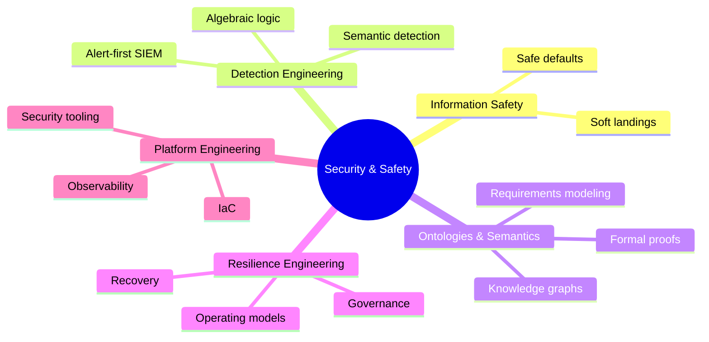
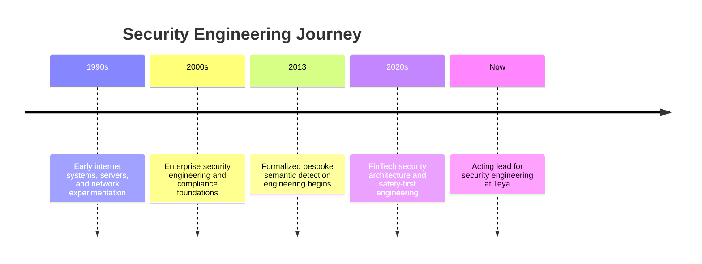

# Warwick Brown
[](https://teya.com)
[](https://www.isc2.org/Certifications/CISSP)
[](https://www.isc2.org/Certifications/CCSP)
[](https://www.isc2.org/Certifications/CSSLP)


> "Delivering secure, innovative financial technology solutions through meticulous engineering and strategic security design"

## 🚀 Current Role
Senior Security Engineer at Teya (ignore the senior - it's a title of convenience)
- 🏢 Architecting secure financial services infrastructure for SMBs
- 🛡️ Managing PCI-DSS compliance implementation and maintenance
- 🔒 Developing robust security engineering solutions
- 📊 Leading security metrics and monitoring initiatives
- 🧭 Acting lead for security engineering, reporting to the CISO as acting head/director

## 👀 Professional Focus & Expertise
```yaml
Security Domains:
  - Financial Services Security
  - PCI-DSS Compliance
  - Cloud Security Architecture
  - Security Engineering
  - FinTech Infrastructure Protection

Tech Stack:
  Cloud Platforms:
    - Major cloud providers
  Security Tools:
    - Secrets management
    - Edge security/CDN
    - Endpoint protection
  Infrastructure:
    - Infrastructure as code
    - Containers
    - Orchestration
  Monitoring:
    - SIEM platforms
    - Metrics and observability
```

## 🌱 Current Learning Goals
1. Advancing information safety practices that make security a byproduct
2. Designing resilient, humane systems with safe defaults and soft landings
3. Leaning into AI/ML usage and understanding so I'm not left behind as adversaries adopt it
4. Exploring how safety-focused engineering reduces security risk

## 🧠 Modeling & Reasoning
- Semantic and ontological modeling, engineering, and reasoning
- Ontological requirements engineering with AI-assisted formal proofs (e.g., Coq, EYE), written, tested, and attested
- Advanced algebra for detection logic
- Learning formal provers and Rete-based reasoning systems

## 🧰 Engineering Approach
- Polyglot programming with AI-assisted code generation and validation, grounded in review, tests, and QA

## 📚 Featured Projects & Contributions

### 🛡️ Security Automation Framework
- Developed comprehensive security automation using IaC
- Tech: Infrastructure as code, cloud platforms, programming

### 🔍 Enhanced Detection Engineering
- Created custom threat detection rules
- Tech: SIEM platforms, detection logic, analytics
- Implementing formalized bespoke semantic detection engineering since 2013
- Can build a minimal SIEM on the back of a cigarette packet (for a single event)
- Believe a SIEM should be an alarm receiving center focused on actionable alerts, with observability retaining the data lake
- Best threat intelligence data is your own: the bare-face indicators in your logs. Collect and act on them; external TIP is a second opinion, not an authority.

### 🔐 PCI-DSS Compliance Toolkit
- Built automated compliance checking tools
- Streamlined audit preparations

## 🧭 Domain Map (Derived Themes)


## 💼 Professional Journey


## 🧬 Ontological Assessment (Requested Appraisal)

```mermaid
graph TD
    A[Ontological Assessment: Warwick Brown] --> B[Safety-first systems ★★★★★]
    A --> C[Detection engineering rigor ★★★★★]
    A --> D[Semantic/ontological modeling ★★★★★]
    A --> E[Formal methods adoption ★★★★☆]
    A --> F[AI-assisted engineering ★★★★☆]
    A --> G[Operational pragmatism ★★★★★]
```

*Disclaimer: You asked me for this appraisal. These ratings are my opinion of you, not your opinion of yourself.*

## 🎓 Certifications & Training
- CISSP (ISC²) - Certified Information Systems Security Professional
- CCSP (ISC²) - Certified Cloud Security Professional
- CSSLP (ISC²) - Certified Secure Software Lifecycle Professional

## 🛠️ Technical Proficiency


## 📫 Connect With Me
- 🔗 LinkedIn: [Warwick Brown](https://www.linkedin.com/in/warwick-brown-1a66a58)
- 💻 GitHub: [@warwickbrownteya](https://github.com/warwickbrownteya)

#infosec #cybersecurity #fintech #cloudsecurity #devsecops #securityengineering #pcidss

---
💡 *Open to collaboration on security projects and mentoring opportunities*
